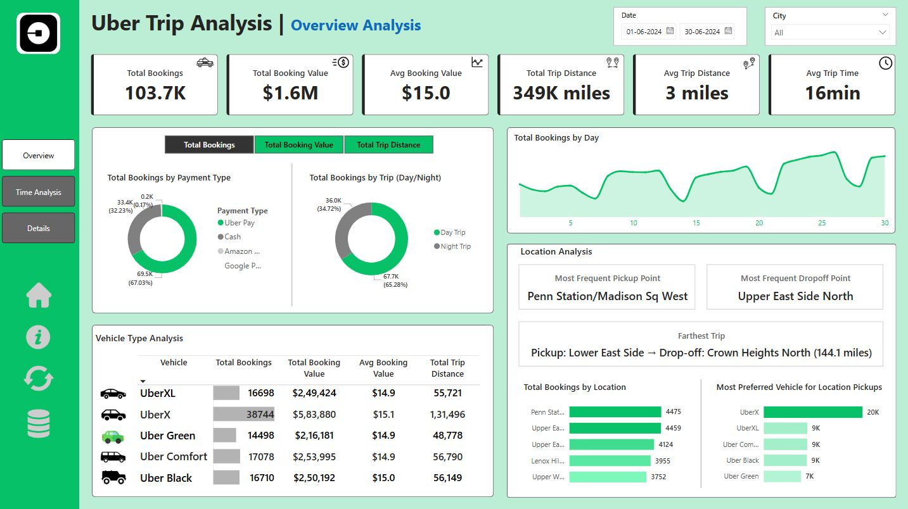
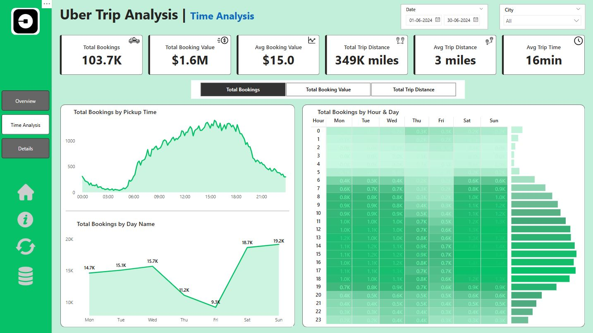
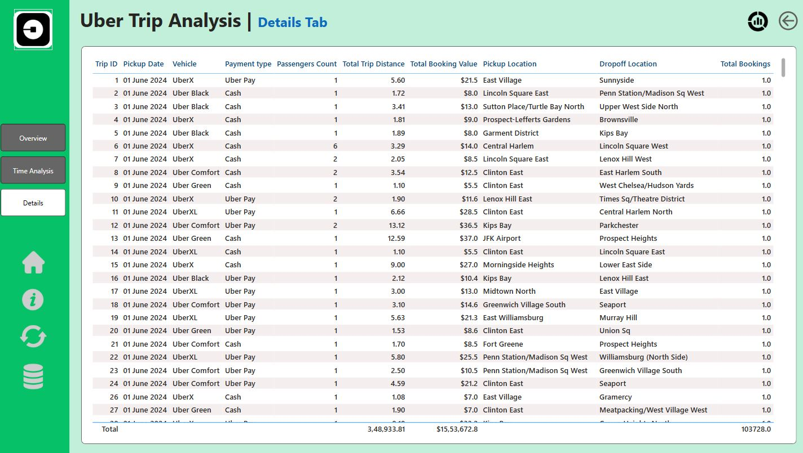

# 🚕 Uber Trip Analysis Dashboard - Power BI

An interactive Power BI dashboard project to analyze Uber trip data and uncover trends in bookings, revenue, trip durations, and customer behavior.

## 📊 Project Summary

This project provides a comprehensive analytical view of Uber ride data to support data-driven decision-making for operational improvements and customer insights. The dashboard is built in **Power BI** and contains:

- Key Metrics like Total Bookings, Revenue, Trip Distance, and Duration
- Booking trends by Time of Day, Day of Week, and Vehicle Type
- Geospatial analysis of pickup/drop-off locations
- Dynamic measure and slicer functionality
- Export and drill-through capabilities for deeper data exploration

---

## 📁 Files Included

| File | Description |
|------|-------------|
| `uber trip analysis.pbix` | Main Power BI dashboard file |
| `Uber Trip Details.xlsx` | Raw dataset used for analysis |
| `Location Table.xlsx` | Additional mapping and reference data |
| `fig1.JPG`, `fig2.JPG`, `fig3.JPG` | Screenshots of the dashboards |
| `jeFa6LUKaDRzqLjAgX57cu.docx` | Project documentation and design specifications |

---

## 💡 Key Features

### 🔹 Dashboard 1: Overview Analysis
- **KPIs**: Total Bookings, Revenue, Average Booking, Distance & Time
- **Charts**:
  - Total Bookings by Payment Type
  - Day vs Night Trip Split
  - Vehicle Type Performance
  - Most Frequent Pickup & Dropoff Points
  - Farthest Trip Info
  - Top 5 Booking Locations
  - Preferred Vehicles by Location

### 🔹 Dashboard 2: Time Analysis
- **Dynamic Metric Selection**: Bookings / Value / Distance
- **Visuals**:
  - Bookings by Pickup Time (Area Chart)
  - Bookings by Day of Week (Line Chart)
  - Heatmap of Bookings by Hour & Day

### 🔹 Dashboard 3: Details Tab
- Interactive grid view with:
  - Trip ID, Vehicle Type, Payment, Distance, Locations, Value
  - Drill-through from visual elements for detailed inspection

---

## 🧠 Business Insights

- Identify **peak ride hours and days**
- Compare **vehicle performance** and customer preferences
- Detect **high-demand areas** for resource allocation
- Optimize **pricing and fleet distribution strategies**

---

## 🛠️ Getting Started

To open and explore this dashboard:

1. Download the `.pbix` file from this repository
2. Open in **Power BI Desktop** (free from Microsoft)
3. Ensure all dataset files (`.xlsx`) are in the same directory (or update file paths)
4. Explore filters, slicers, and visualizations

---

## 🖼️ Screenshots

### 📍 Overview Dashboard

### 🕐 Time Analysis

### 📋 Details Grid

---

**Visualization & UX:** Built using Power BI native visuals and DAX measures

---

## 📌 Tags

`#PowerBI` `#DataVisualization` `#UberAnalytics` `#BusinessIntelligence` `#DataDashboard` `#ETL` `#TripAnalysis`

---

## 📬 Contact

For questions or suggestions, feel free to connect on [LinkedIn](#) or open an issue in this repository.

